# efOfX Architecture Diagrams

This document provides visual representations of the efOfX AI-Powered Estimation Platform architecture using mermaid diagrams.

---

## Table of Contents
1. [System Overview](#system-overview)
2. [Multi-Tenant Architecture](#multi-tenant-architecture)
3. [Authentication Flow](#authentication-flow)
4. [White Label Widget Integration](#white-label-widget-integration)
5. [Estimation Request Flow](#estimation-request-flow)
6. [Feedback Loop & Calibration](#feedback-loop--calibration)
7. [Data Model](#data-model)
8. [Deployment Architecture](#deployment-architecture)
9. [Domain-Agnostic Design](#domain-agnostic-design)

---

## System Overview

High-level system architecture showing all major components and their relationships.


---

## Multi-Tenant Architecture

Zero-trust multi-tenant isolation pattern with BYOK (Bring Your Own Key) for OpenAI.


---

## Authentication Flow

Three-layer authentication system for different actors in the system.

```mermaid
sequenceDiagram
    participant User as Tenant Admin/User
    participant Widget as Chat Widget
    participant API as FastAPI Backend
    participant MCP as MCP Serverless
    participant DB as MongoDB
    
    Note over User,MCP: Layer 1: User → API (JWT)
    User->>API: Login with credentials
    API->>DB: Verify user & tenant
    DB-->>API: User record
    API->>API: Generate JWT<br/>(tenant_id, role, exp)
    API-->>User: JWT Bearer Token
    User->>API: Request with JWT
    API->>API: Validate JWT & extract tenant_id
    API-->>User: Response
    
    Note over Widget,MCP: Layer 2: Widget → API (Session Token)
    Widget->>API: Initialize widget session
    API->>API: Generate session token
    API-->>Widget: Session token
    Widget->>API: Estimate request + session token
    API->>API: Validate session
    API-->>Widget: Estimate response
    
    Note over API,MCP: Layer 3: API → MCP (HMAC + JWT)
    API->>API: Generate HMAC signature
    API->>MCP: Request with HMAC + JWT
    MCP->>MCP: Verify HMAC & JWT
    MCP-->>API: Response
```



---

## White Label Widget Integration

How contractors/agencies embed the widget on their websites.


**Embed Code Example:**
```html
<div id="efofx-widget"></div>
<script src="https://widget.efofx.ai/embed.js"></script>
<script>
  efofxWidget.init({
    apiKey: 'efofx_...',
    primaryColor: '#2563eb',
    logo: 'https://partner.com/logo.png',
    companyName: 'ACME Construction'
  });
</script>
```

---

## Estimation Request Flow

Complete flow from user question to estimate with reference class matching.


---

## Feedback Loop & Calibration

Self-improving system through actual project outcome tracking.


**Calibration Metrics Displayed to Users:**
- "73% of estimates within 10% for similar projects"
- "Typical variance: +12% for kitchen remodels in SoCal"
- "Truth Integrity Score: 92%"

---

## Data Model

Core MongoDB collections with tenant isolation.


**Critical Indexes:**
```javascript
// ALL indexes include tenant_id first for isolation
db.reference_classes.createIndex({ tenant_id: 1, category: 1, region: 1 })
db.estimates.createIndex({ tenant_id: 1, created_at: -1 })
db.estimates.createIndex({ tenant_id: 1, estimate_id: 1 })
db.feedback.createIndex({ tenant_id: 1, estimate_id: 1 })
```

---

## Deployment Architecture

DigitalOcean App Platform with auto-deploy and zero-downtime rolling deployments.


**Deployment Flow:**
1. `git push origin main`
2. DO detects push
3. Build Docker image (2-3 min)
4. Zero-downtime rolling deployment (30 sec)
5. Old instances drained, new instances live

**Monitoring:**
- DO App Platform: CPU, memory, restarts
- Sentry: Error tracking + performance tracing
- Both FREE for MVP

---

## Domain-Agnostic Design

How the same engine supports construction, IT/dev, and future domains.

```mermaid
graph TB
    subgraph "User Input"
        U1[Construction:<br/>"Remodel kitchen"]
        U2[IT/Dev:<br/>"Build REST API"]
        U3[Future:<br/>"Plan marketing campaign"]
    end
    
    subgraph "LLM Parsing"
        LLM[GPT-4o-mini<br/>Domain Detection]
    end
    
    subgraph "Domain-Specific Context"
        P1[Prompt Config:<br/>construction]
        P2[Prompt Config:<br/>it_dev]
        P3[Prompt Config:<br/>marketing]
    end
    
    subgraph "Domain-Agnostic Core"
        Match[Matching Algorithm<br/>Generic]
        RCF[RCF Engine<br/>Generic]
    end
    
    subgraph "Reference Classes by Domain"
        RC1[(Construction:<br/>kitchen_remodel<br/>cost: USD<br/>timeline: weeks)]
        RC2[(IT/Dev:<br/>api_development<br/>cost: person-weeks<br/>timeline: sprints)]
        RC3[(Marketing:<br/>campaign_launch<br/>cost: USD<br/>timeline: months)]
    end
    
    subgraph "Output"
        O1[Domain-Specific<br/>Narrative]
    end
    
    U1 --> LLM
    U2 --> LLM
    U3 --> LLM
    
    LLM --> P1
    LLM --> P2
    LLM --> P3
    
    P1 --> Match
    P2 --> Match
    P3 --> Match
    
    Match --> RC1
    Match --> RC2
    Match --> RC3
    
    RC1 --> RCF
    RC2 --> RCF
    RC3 --> RCF
    
    RCF --> O1
    
    style LLM fill:#ff6b6b
    style Match fill:#4CAF50
    style RCF fill:#2196F3
```

**Key Design Principles:**
- **Flexible Schema:** `attributes` field in reference classes is a Dict (schema-less)
- **Domain Context:** Git-based JSON prompts have domain-specific terminology
- **Currency/Units:** Stored in `cost_distribution.currency` and `timeline_distribution.unit`
- **Same Algorithm:** Matching and RCF work identically across domains

**Adding a New Domain Checklist:**
1. ✅ Create synthetic data generator in `generators/{domain}.py`
2. ✅ Define domain-specific `attributes` schema
3. ✅ Specify `currency` and `unit` for distributions
4. ✅ Add domain context to prompt config JSON
5. ✅ Add domain to `SUPPORTED_CATEGORIES` list
6. ✅ Seed database with `python seed_database.py --domain {domain}`
7. ✅ Test matching and narrative generation

---

## Technology Stack Summary


---

## Core Architectural Patterns

### 1. Multi-Tenant Isolation (Zero Trust)
```python
# ✅ CORRECT: All queries scoped by tenant
async def get_reference_classes(tenant_id: str, category: str):
    return await db.reference_classes.find({
        "tenant_id": tenant_id,  # REQUIRED
        "category": category
    }).to_list(None)
```

### 2. BYOK Security
- Encrypt OpenAI keys at rest (AES-256)
- Decrypt only at request time
- Never log decrypted keys
- Per-tenant API key isolation

### 3. LLM Retry Logic
- 3 attempts with exponential backoff
- 2-10 second delays
- Graceful degradation on failure
- Sentry error tracking

### 4. Feedback Loop
- Track `prompt_version` with each estimate
- Submit actual outcomes post-project
- Calculate calibration metrics by domain
- Auto-tune distributions over time

### 5. Domain Agnostic
- Flexible `attributes` schema
- Domain-specific prompt contexts
- Currency/unit stored with distributions
- Same matching algorithm for all domains

---

## MVP Scope

**Built in MVP:**
- ✅ Multi-tenant FastAPI backend
- ✅ White label chat widget (React + Shadow DOM)
- ✅ Construction domain (7 subcategories)
- ✅ Synthetic reference class generation
- ✅ Feedback submission system
- ✅ Git-based prompt management
- ✅ BYOK OpenAI integration
- ✅ DO App Platform deployment
- ✅ DO Spaces CDN for widget

**Fast Follow (Post-MVP):**
- ⏳ IT/Dev domain (5 subcategories)
- ⏳ Tenant admin dashboard
- ⏳ Calibration metrics display
- ⏳ "Coach Mode" communication guidance

**Future:**
- 🔮 Agent swarm architecture
- 🔮 Finance domain
- 🔮 Healthcare domain
- 🔮 Tenant-custom domains
- 🔮 Visual drag-and-drop interface
- 🔮 Integration with Jira/Linear/Asana

---

## Key Design Principles

1. **"Trust Through Transparency"** - Make the reasoning visible
2. **"Communication Coach"** - Teach stakeholders probabilistic thinking
3. **Zero Cross-Tenant Data Leakage** - 100% tenant isolation
4. **Self-Improving System** - Feedback loop tunes future estimates
5. **Domain-Agnostic Core** - Same engine, different domains
6. **Distribution Over Distribution** - White label widget beats direct users
7. **MVP Discipline** - Ship fast, iterate with real users

---

_Generated from architecture.md and bmm-brainstorming-session-2025-11-09.md_
_Date: 2025-11-10_
